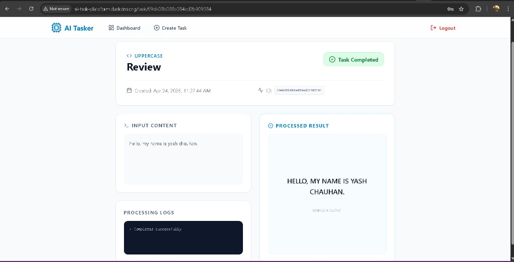
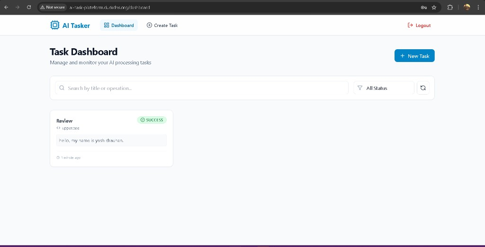
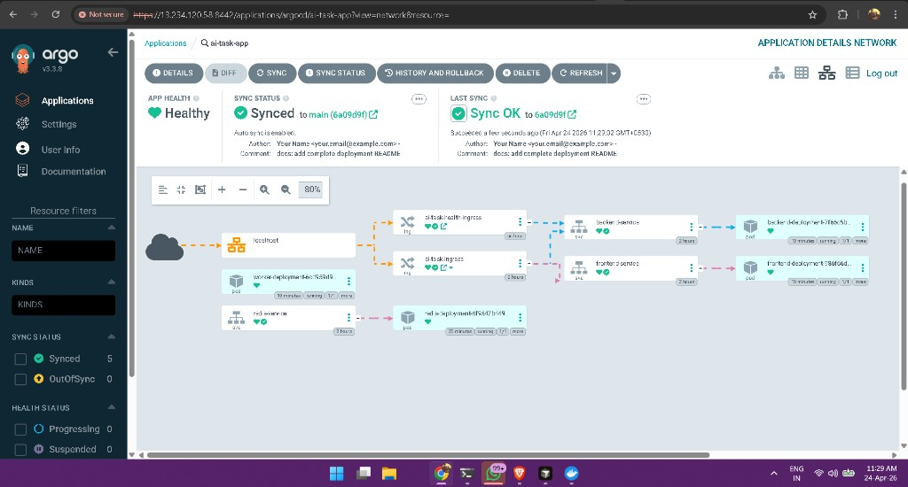
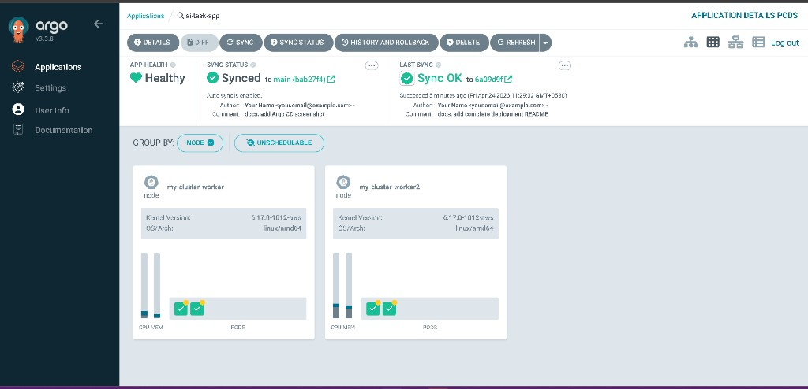
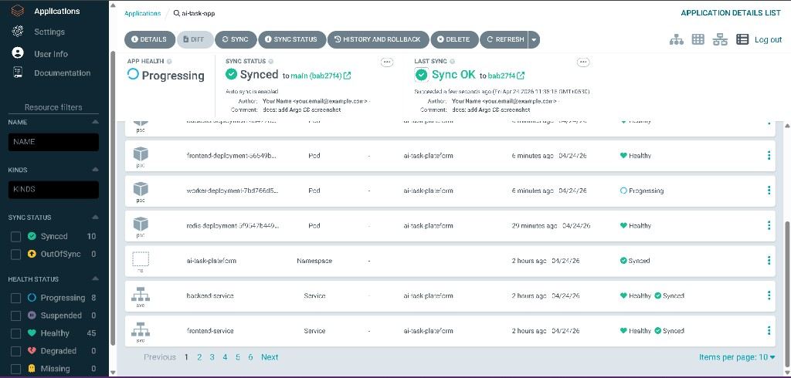

## AI Task Platform (MERN + Redis + Worker) — Kubernetes + Argo CD GitOps

Full-stack app deployed on Kubernetes (frontend, backend, redis, worker) and exposed via **ingress-nginx**. Uses **Argo CD** for GitOps and **Argo CD Image Updater** to automatically roll out the **latest Docker images**.

### App screenshots





### Live URLs
- **App**: `http://ai-task-plateform.duckdns.org/`
- **Backend health**: `http://ai-task-plateform.duckdns.org/api/health`
- **Argo CD UI (EC2)**: `https://<EC2_PUBLIC_IP>:8442` (port-forward service on the node)

---

## Folder structure

```text
mernstackproject/
  Backend/                     # Node/Express API
  frontend/                    # React (built to static nginx image for K8s)
  worker/                      # Worker process (consumes queue / background tasks)
  k8s/                         # Kubernetes manifests (GitOps source)
    namespace.yaml
    redis-deployment.yaml
    redis-service.yaml
    backend-deployment.yaml
    backend-service.yaml
    frontend-deployment.yaml
    frontend-service.yaml
    worker-deployment.yaml
    ingress.yaml
    health-ingress.yaml
    argocd.yaml
    image-updater.yaml
    kustomization.yaml
  .github/workflows/docker-image.yml   # CI builds & pushes Docker images
  docker-compose.yaml           # Local docker-compose (redis/backend/frontend/worker)
  README.md
```

---

## Architecture (Kubernetes traffic flow)

```mermaid
flowchart LR
  U[User Browser] --> DNS[DuckDNS\nai-task-plateform.duckdns.org]
  DNS --> EC2[EC2 Public IP :80]
  EC2 --> IN[ingress-nginx Controller\n(kind hostPort 80)]

  IN -->|/| FE_SVC[frontend-service\nClusterIP :80]
  FE_SVC --> FE_POD[frontend-deployment\nnginx static :80]

  IN -->|/api/*| BE_SVC[backend-service\nClusterIP :5000]
  BE_SVC --> BE_POD[backend-deployment\nExpress :5000]

  BE_POD --> REDIS_SVC[redis-service\nClusterIP :6379]
  REDIS_SVC --> REDIS_POD[redis-deployment\nredis :6379]

  WORKER[worker-deployment] --> REDIS_SVC
  WORKER --> BE_SVC
```

---

## Kubernetes resources (what’s deployed)

### Namespace
- **Namespace**: `ai-task-plateform` (`k8s/namespace.yaml`)

### Workloads
- **Frontend**: `k8s/frontend-deployment.yaml`
  - containerPort: `80`
  - readiness/liveness probes on `/`
  - image: `yashchauhan6660/ai-task-frontend:latest`
- **Backend**: `k8s/backend-deployment.yaml`
  - containerPort: `5000`
  - readiness/liveness probes on `/health`
  - image: `yashchauhan6660/ai-task-backend:latest`
  - requires Secret: `app-secret` (MONGO_URI, Secret_Key, REDIS_HOST, REDIS_PORT)
- **Redis**: `k8s/redis-deployment.yaml`
  - port: `6379`
  - tcp readiness/liveness probes
- **Worker**: `k8s/worker-deployment.yaml`
  - image: `yashchauhan6660/ai-task-worker:latest`
  - requires Secret: `app-secret`

### Services (ClusterIP)
- `frontend-service` :80
- `backend-service` :5000
- `redis-service` :6379

### Ingress
- `k8s/ingress.yaml`
  - `host: ai-task-plateform.duckdns.org`
  - `/` → frontend-service:80
  - `/api` (Prefix) → backend-service:5000
- `k8s/health-ingress.yaml`
  - `/api/health` (Exact) → backend-service:5000 (rewrite to `/health`)

---

## Local development options

### Option A: Docker Compose (recommended locally)

1) Create `.env` values (example):

```bash
MONGO_URI="mongodb+srv://..."
Secret_Key="your_jwt_secret"
```

2) Run:

```bash
docker compose up --build
```

Services:
- Backend: `http://localhost:5000`
- Redis: `localhost:6379`
- Frontend: `http://localhost:3000`

### Option B: Run frontend locally (dev server)

```bash
cd frontend
npm install
npm start
```

---

## Production: Kubernetes on EC2 using kind + ingress-nginx

### Prereqs
- EC2 Security Group inbound:
  - **80/tcp** (public)
  - **8442/tcp** (optional, for Argo CD UI)
- DuckDNS A record points to EC2 public IP
- Docker + kind + kubectl installed on EC2

### Create kind cluster with host ports 80/443
Example `kind-config.yaml` (concept):
- control-plane has hostPort 80/443 mapped (so ingress-nginx can bind to host)

### Install ingress-nginx
Use the kind provider manifest:

```bash
kubectl apply -f https://raw.githubusercontent.com/kubernetes/ingress-nginx/main/deploy/static/provider/kind/deploy.yaml
kubectl -n ingress-nginx get pods
```

### Create the Secret (required)
This project intentionally keeps secrets out of Git.

```bash
kubectl -n ai-task-plateform create secret generic app-secret \
  --from-literal=MONGO_URI="..." \
  --from-literal=Secret_Key="..." \
  --from-literal=REDIS_HOST="redis-service" \
  --from-literal=REDIS_PORT="6379"
```

### Deploy app manifests (non-GitOps)

```bash
kubectl apply -f k8s/namespace.yaml
kubectl apply -f k8s/redis-deployment.yaml
kubectl apply -f k8s/redis-service.yaml
kubectl apply -f k8s/backend-deployment.yaml
kubectl apply -f k8s/backend-service.yaml
kubectl apply -f k8s/frontend-deployment.yaml
kubectl apply -f k8s/frontend-service.yaml
kubectl apply -f k8s/worker-deployment.yaml
kubectl apply -f k8s/ingress.yaml
kubectl apply -f k8s/health-ingress.yaml
```

Verify:

```bash
kubectl -n ai-task-plateform get pods,svc,endpoints,ing
curl -I http://ai-task-plateform.duckdns.org/
curl -i http://ai-task-plateform.duckdns.org/api/health
```

---

## GitOps: Argo CD + Image Updater (recommended)

### 1) Install Argo CD

```bash
kubectl create namespace argocd
kubectl apply -n argocd -f https://raw.githubusercontent.com/argoproj/argo-cd/stable/manifests/install.yaml
kubectl -n argocd get pods
```

### 2) Create Argo CD Application
Apply:
- `k8s/argocd.yaml` (tracks repo `k8s/` and uses `kustomization.yaml`)

```bash
kubectl apply -f k8s/argocd.yaml
kubectl -n argocd get application ai-task-app
```

### 3) Install Image Updater and enable annotation-based updates

```bash
kubectl apply -n argocd -f https://raw.githubusercontent.com/argoproj-labs/argocd-image-updater/stable/config/install.yaml
kubectl apply -f k8s/image-updater.yaml
kubectl -n argocd logs deploy/argocd-image-updater-controller --tail=50
```

Image updater behavior:
- Watches `:latest` tags on Docker Hub
- Pins deployments to **digest** (immutable) automatically

### 4) Expose Argo CD UI on port 8442 (EC2)
This repo uses a persistent port-forward systemd service:

```bash
sudo systemctl status argocd-portforward
```

Get admin password:

```bash
kubectl -n argocd get secret argocd-initial-admin-secret -o jsonpath='{.data.password}' | base64 -d; echo
```

### Argo CD screenshot



#### More Argo CD views





---

## CI/CD (Docker build + push)

GitHub Actions workflow:
- `.github/workflows/docker-image.yml`

On every push to `main` it builds & pushes:
- `yashchauhan6660/ai-task-backend:v1.0.<run_number>` and `:latest`
- `yashchauhan6660/ai-task-frontend:v1.0.<run_number>` and `:latest`
- `yashchauhan6660/ai-task-worker:v1.0.<run_number>` and `:latest`

Argo CD Image Updater then updates the live app to the newest **digest**.

---

## Troubleshooting

### 502/503 from ingress
```bash
kubectl -n ingress-nginx logs deploy/ingress-nginx-controller --tail=200
kubectl -n ai-task-plateform get endpoints
```
If endpoints are empty → pod isn’t Ready (check probes/logs).

### Backend/worker stuck: CreateContainerConfigError
Usually missing `app-secret`:
```bash
kubectl -n ai-task-plateform get secret app-secret
```

### Check rollout health
```bash
kubectl -n ai-task-plateform rollout status deploy/frontend-deployment
kubectl -n ai-task-plateform rollout status deploy/backend-deployment
kubectl -n ai-task-plateform rollout status deploy/worker-deployment
```

